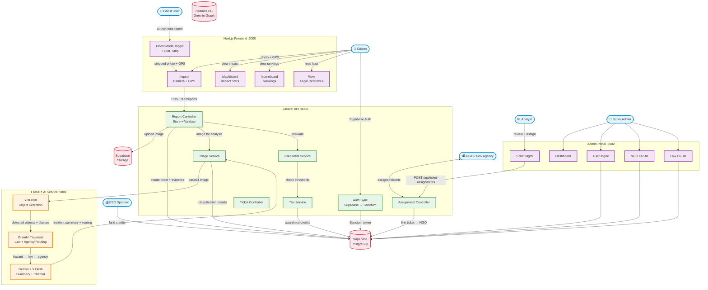
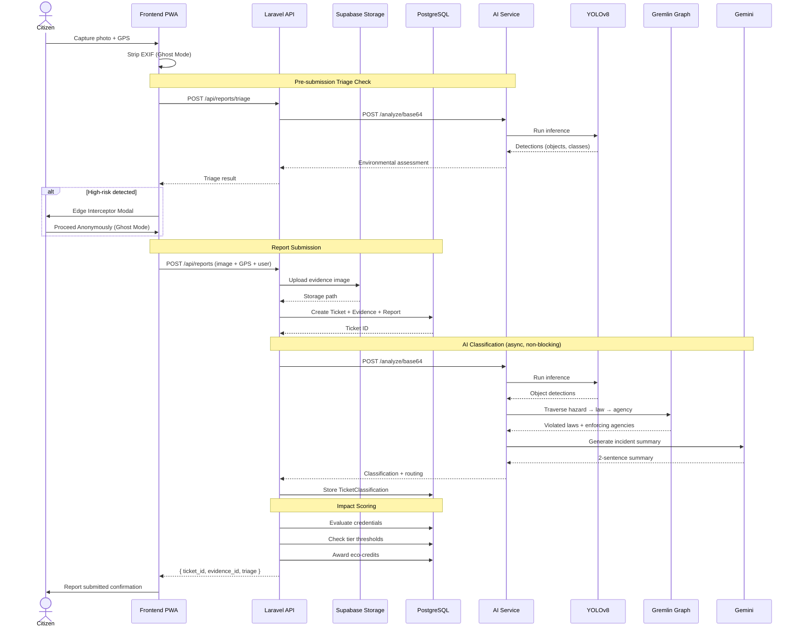
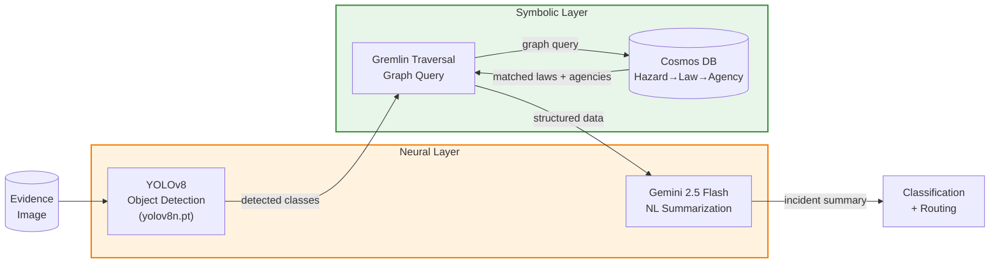
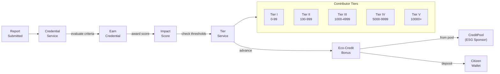

# LikasLens Data Flow Diagram

> Neuro-Symbolic Civic Reporting Platform

## System Architecture Overview

## Report Submission Sequence

## Neuro-Symbolic AI Pipeline

## Impact & Credential Flow

